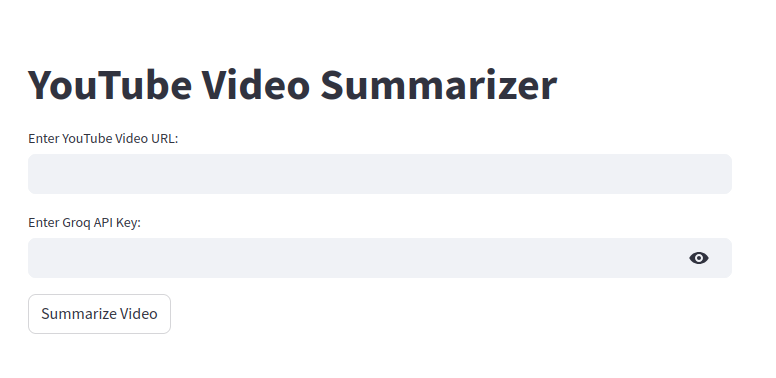
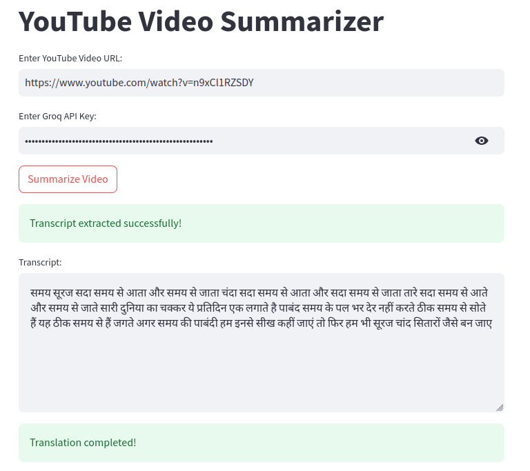
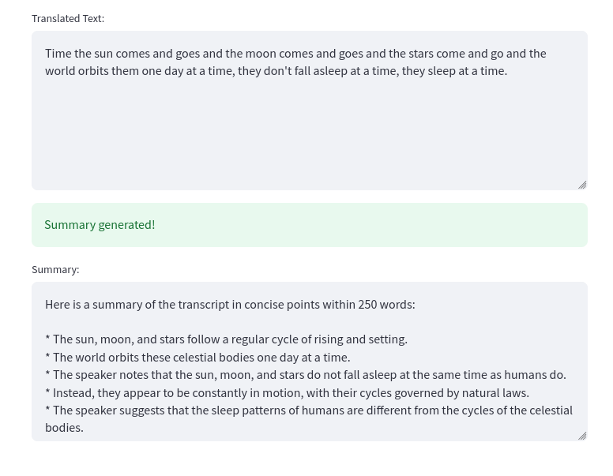

# YouTube Video Summarizer

This is a Streamlit-based web application that extracts transcripts from YouTube videos, translates them (if necessary), and generates concise summaries using Groq's AI models.

## Features
- Extracts transcripts from YouTube videos
- Automatically detects the transcript language
- Translates transcripts into English (if needed)
- Generates concise summaries using LLaMA-3.3-70B model via Groq API

## Installation

### Prerequisites
```bash
- Python 3.10
- A Groq API key
- A Hugging Face account (for NLLB translation model)
```

### Clone the Repository
```bash
git clone https://github.com/officialshivansh26/Youtube_Video_Summariser.git
cd Youtube_Video_Summariser
```

### Install Dependencies
```bash
pip install -r requirements.txt
```

## Usage
```bash
1. Run the Streamlit app:
   streamlit run app.py

2. Enter a YouTube video URL.
3. Provide your Groq API key.
4. Click on the **Summarize Video** button.
5. View the extracted transcript, translated text, and the generated summary.
```

## File Structure
```bash
/Youtube_Video_Summariser
│── app.py              # Main Streamlit app
│── requirements.txt    # Required dependencies
│── README.md           # Project documentation
│── screenshots/        # Folder for output screenshots
```

## Example Output

### Extracted Transcript


### Translated Text


### Generated Summary



## API Requirements
```bash
- Groq API Key: Required for generating summaries.
- Hugging Face Model (NLLB-200): Used for transcript translation.
```

## Contributions
```bash
Contributions are welcome! Feel free to fork the repo and submit pull requests.
```

## License
```bash
This project is licensed under the MIT License.
```

